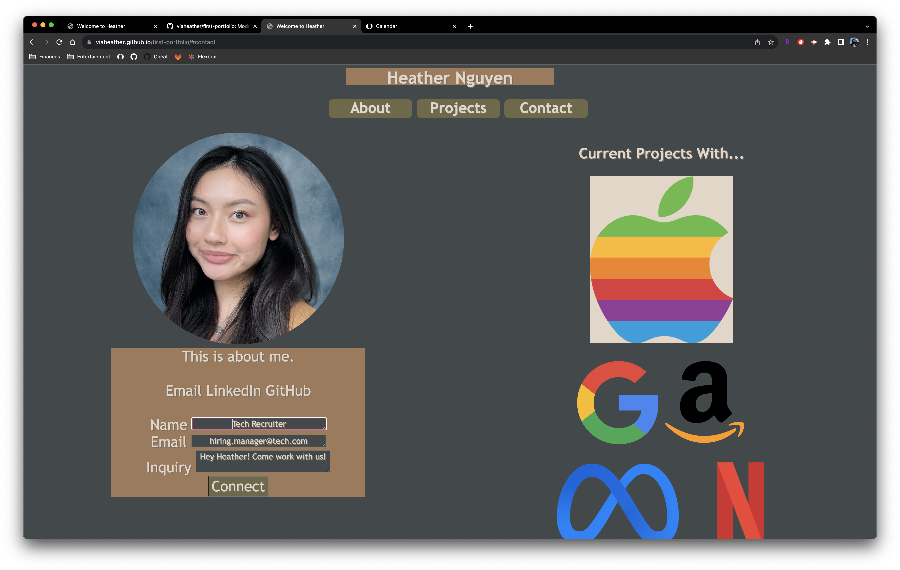

# 💼 First Portfolio

* Created a GitHub page that hosts my first portfolio

* Pseudo projects used as placeholders until real projects are added.

* Nav bar links, when clicked, will take the visitor to the area of the webpage

* Contact sheet added for recruiters

* Viewport is responsive based on webpage size

* Project images include alt text

